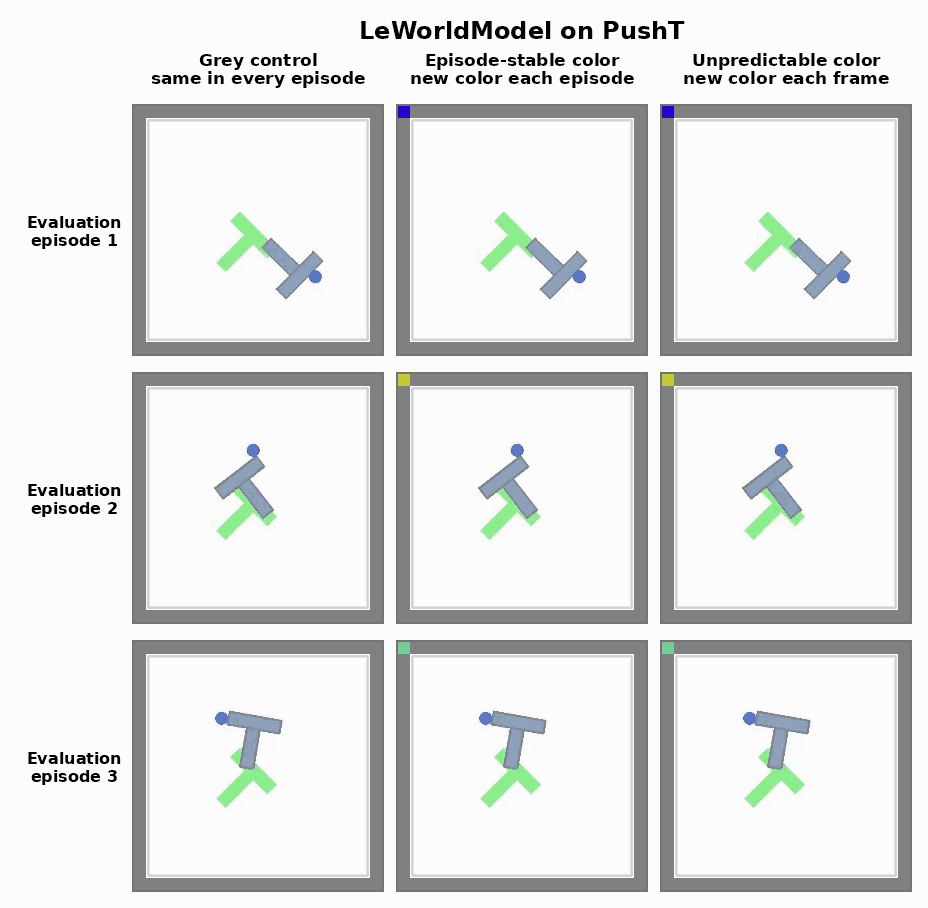
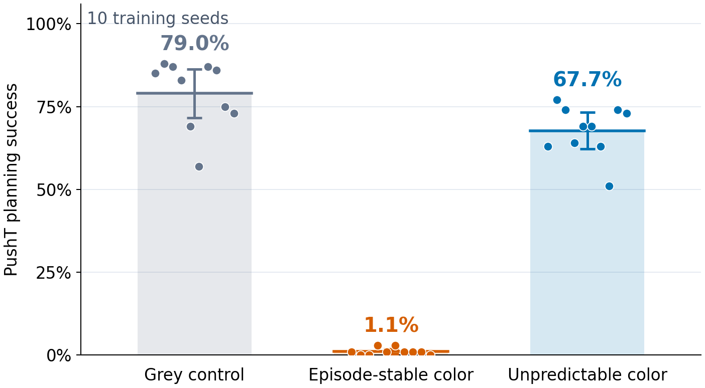

# JEPA Stable-Token Failure

One task-irrelevant visual token can destroy planning in a JEPA world model. Making the same token unpredictable substantially restores performance.

<p align="center">
  
</p>

This repository is a minimal reproduction of that result using [LeWorldModel](https://arxiv.org/abs/2603.19312) on PushT.

## Result

We place the original 224×224 PushT frame inside a 252×252 grey canvas. One complete 14×14 ViT patch in the top-left corner carries a task-irrelevant color. It occupies 1 of 324 image tokens, or 0.31% of the input pixels, and never occludes a task pixel.

We train separate models under three matched conditions:

- **Grey control:** the patch remains grey in every episode.
- **Episode-stable color:** a new RGB color is sampled for each episode and remains fixed within it.
- **Unpredictable color:** a new RGB color is sampled independently at every model frame.

The colored conditions have the same patch size, contrast, and marginal color distribution. Only temporal predictability changes.

<p align="center">
  
</p>

Across ten paired training seeds, mean closed-loop planning success is 79.0% for the grey control, 1.1% for the episode-stable color, and 67.7% for the unpredictable color. The recovery is large but partial.

## Installation

Python 3.10 and a CUDA GPU are recommended.

```bash
git clone git@github.com:huguesva/jepa-stable-token-failure.git
cd jepa-stable-token-failure

python -m venv .venv
source .venv/bin/activate
pip install -r requirements.txt
```

The implementation is pinned to the `stable-worldmodel` revision used in the original experiment.

## Data

The official PushT dataset is 13.1 GB compressed and requires substantially more space after decompression.

```bash
export STABLEWM_HOME=/path/to/lewm-data
bash scripts/download_data.sh
```

This downloads `pusht_expert_train.h5.zst` from the official [`quentinll/lewm-pusht`](https://huggingface.co/datasets/quentinll/lewm-pusht) dataset and decompresses it to `$STABLEWM_HOME/pusht_expert_train.h5`.

## Reproduce one paired seed

```bash
export STABLEWM_HOME=/path/to/lewm-data
export PYTHON=$PWD/.venv/bin/python
bash scripts/run_seed.sh 4711
```

This trains three models for two epochs and evaluates each model on two sets of 50 PushT episodes. Outputs are written under `outputs/` and completed stages are reused when the command is restarted.

The exact ten predeclared seeds are:

```text
4711 8123 2659 6011 7297 8837 9187 10427 11717 12829
```

To run them sequentially:

```bash
bash scripts/run_all.sh
```

Each seed is independent, so the ten `run_seed.sh` invocations can instead be submitted as separate jobs on a cluster.

## Regenerate the figure

The reference seed-level scores are retained in [`results/reference_scores.csv`](results/reference_scores.csv):

```bash
python scripts/plot_results.py
```

After running the experiment, collect and plot the generated evaluation reports with:

```bash
python scripts/plot_results.py --eval-dir outputs/evals --output results/reproduction
```

The plotter validates the nuisance geometry, temporal regime, evaluation seeds, matched goal nuisance, episode count, and retained per-episode outcomes before reporting a result.

## Test the intervention

The lightweight tests verify that the patch occupies exactly one token, never changes a task pixel, is constant within an episode at `rho=1`, changes every frame at `rho=0`, and is deterministic under replay.

```bash
python -m unittest discover -s tests -v
```

## Experimental details

- Model: LeWorldModel with a ViT-Tiny encoder and SIGReg.
- Input: 224×224 PushT scene padded to 252×252.
- Nuisance: one 14×14 corner token, full RGB amplitude.
- Training: two epochs, identical model and optimizer settings in all arms.
- Evaluation: two seeds × 50 episodes for each trained model, with the two results averaged before each model contributes one point.
- Goal handling: the current observation and goal receive the same nuisance realization, so the patch does not create an unreachable nuisance goal.
- Inference unit: one independently trained model (`n=10` per arm).

The fixed nuisance generator means uncertainty reflects training variability across the ten seeds, not variability over independently redrawn nuisance datasets.

The LeWorldModel implementation is adapted from [`lucas-maes/le-wm`](https://github.com/lucas-maes/le-wm) under the MIT license. See [`LICENSE`](LICENSE).
